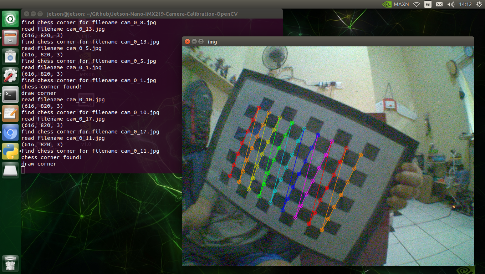
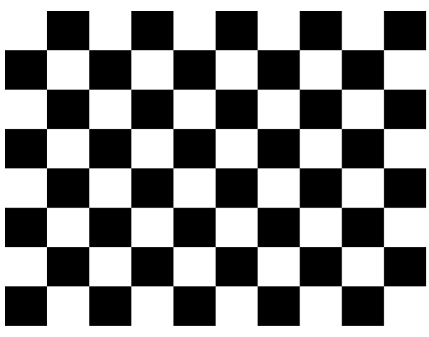

# Jetson Nano IMX219 Camera Calibration using OpenCV
- Camera Calibration is used to reduce radial distortion caused by camera pinhole. Radial distortion causes straight lines to appear curved on image.

## Capture Photo
- We need to print out the `chessboard.png` to be used as checkmark for camera calibration process.

- Run `capture_photo.py` to capture photo using IMX219 Camera by OpenCV. Then We can check the captured photo in folder `capture/`.
- Video source on `capture_photo.py` is generated by Gstreamer Pipeline on `gst_cam.py`
- For this purpose, ensure to install OpenCV with CUDA and Gstreamer enable.
## Find Chessboard Corners & Camera Matrix
- Run `find_chessboard_corners.py` to find Chessboard corners.

- After that, on terminal, we can see the generated camera matrix as below :
    ```
    Camera matrix : 

    [[1.07975414e+03 0.00000000e+00 4.03079138e+02]
    [0.00000000e+00 9.75039165e+02 3.19767861e+02]
    [0.00000000e+00 0.00000000e+00 1.00000000e+00]]

    dist : 

    [[-2.68066717e+00  2.22829147e+01  2.53538754e-02 -5.57868851e-02
    -1.15847689e+02]]
    ```
## Undistortion
- Copy that matrix value then replace the `mtx` and `dist` array value on the `undistortion.py`, `undistortion_remapping.py` and `undistortion_cam_stream.py`
- After that, we do undistortion image by running `undistortion.py` or `undistortion_remapping.py` (undistortion mapping)
- If we want to test using the camera directly to undistort camera frame, just run `undistortion_cam_stream.py`.
# Source :
- https://docs.opencv.org/4.5.1/dc/dbb/tutorial_py_calibration.html
- https://learnopencv.com/camera-calibration-using-opencv/